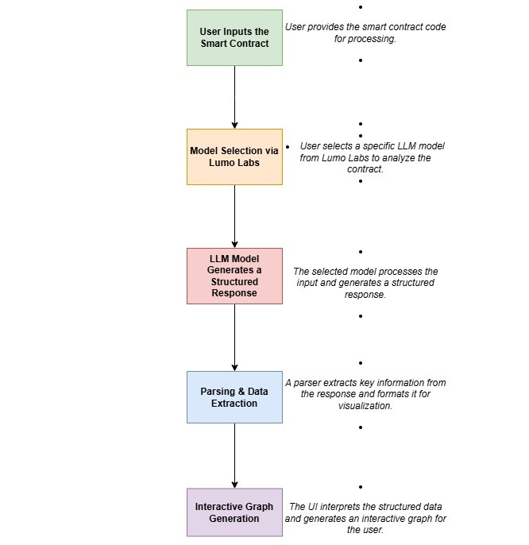

# Smart Contract Visualizer

## Overview
This project provides an interactive visualization tool for smart contracts. Users can input a smart contract, process it through an LLM model via Lumo Labs, and generate a structured, interactive graph representation of the contract's logic and structure.

## Workflow
The project follows these steps:

1. **User Inputs the Smart Contract**  
   - Users provide the smart contract code to be analyzed.

2. **Model Selection via Lumo Labs**  
   - The user selects a specific LLM model from Lumo Labs to process the contract.

3. **LLM Model Generates a Structured Response**  
   - The selected model processes the input and generates a structured response based on predefined patterns.

4. **Parsing & Data Extraction**  
   - A parser extracts key information from the model's response and formats it for visualization.

5. **Interactive Graph Generation**  
   - The UI interprets the structured data and generates an interactive graph for easy contract visualization and analysis.

## Workflow Diagram
Below is the flowchart illustrating the system workflow:



## Features
- **Smart Contract Input:** Accepts smart contract code from the user.
- **LLM Processing:** Uses an LLM model for code analysis and structuring.
- **Parsing Engine:** Extracts relevant details for better visualization.
- **Interactive UI:** Generates a graph-based representation of the contract logic.

## Requirements
To run this project, ensure you have the following dependencies installed:

- Python 3.x
- Node.js (for frontend visualization)
- Lumo Labs API access
- Any required machine learning libraries (e.g., TensorFlow, PyTorch)

## Installation
```bash
# Clone the repository
git clone https://github.com/your-username/smart-contract-visualizer.git

# Navigate to the project directory
cd smart-contract-visualizer

# Install backend dependencies
pip install -r requirements.txt

# Install frontend dependencies
cd frontend
npm install
```

## Usage
```bash
# Start the backend server
python main.py

# Start the frontend
cd frontend
npm start
```

## Contributing
We welcome contributions! Feel free to fork the repository, make improvements, and submit a pull request.

## License
This project is licensed under the MIT License. See the LICENSE file for details.

## Contact
For any questions or support, please reach out to [your-email@example.com](mailto:your-email@example.com).

